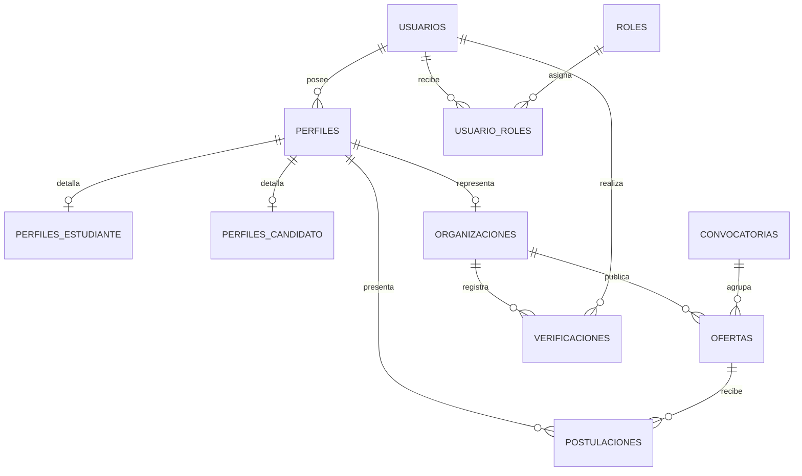

# Esquema inicial de PostgreSQL

## Propósito

Este documento define el modelo relacional inicial para SIPU. Está diseñado para cubrir el MVP de prácticas de la Fase 1 y permitir, sin rediseños incompatibles, los perfiles y ofertas de las fases posteriores.

El archivo ejecutable asociado es [`../backend/database/schema.sql`](../backend/database/schema.sql).

## Decisiones de diseño

- **Usuario y perfil se separan:** una cuenta puede tener varios perfiles a futuro.
- **Roles independientes de perfiles:** los permisos administrativos se gestionan mediante roles, no con condiciones rígidas para cada tipo de usuario.
- **Ofertas clasificadas:** `PRACTICA`, `EMPLEO` y `EMPLEO_PUBLICO` son tipos de oferta, no tipos de usuario.
- **Postulaciones genéricas:** conectan un perfil candidato con cualquier oferta compatible.
- **Extensibilidad:** los detalles académicos, laborales y de organizaciones se almacenan en tablas especializadas.
- **Trazabilidad:** las entidades principales incluyen fechas de creación y actualización.

## Entidades

| Entidad | Responsabilidad |
| --- | --- |
| `usuarios` | Credenciales, datos de contacto y estado de la cuenta. |
| `roles` / `usuario_roles` | Autorización independiente de perfiles. |
| `perfiles` | Identidad funcional de una cuenta: estudiante, candidato externo u organización. |
| `perfiles_estudiante` | Datos académicos del perfil de estudiante. |
| `perfiles_candidato` | Datos laborales del candidato externo. |
| `organizaciones` | Datos y verificación de empresas u organizaciones. |
| `ofertas` | Prácticas, empleos generales y convocatorias de empleo público. |
| `postulaciones` | Relación entre candidato y oferta. |
| `convocatorias` | Agrupación de ofertas públicas para la Fase 4. |
| `verificaciones` | Historial de verificaciones de organizaciones. |

## Relaciones principales



## Tipos controlados

| Tipo | Valores iniciales |
| --- | --- |
| Tipo de perfil | `ESTUDIANTE`, `CANDIDATO_EXTERNO`, `ORGANIZACION` |
| Tipo de oferta | `PRACTICA`, `EMPLEO`, `EMPLEO_PUBLICO` |
| Estado de oferta | `BORRADOR`, `PUBLICADA`, `CERRADA`, `CANCELADA` |
| Estado de postulación | `ENVIADA`, `EN_REVISION`, `PRESELECCIONADA`, `RECHAZADA`, `RETIRADA`, `ACEPTADA` |
| Estado de verificación | `PENDIENTE`, `APROBADA`, `RECHAZADA` |

## Ejecutar el esquema localmente

1. Instale PostgreSQL 15 o superior y cree una base de datos denominada `sipu`.
2. Cree `backend/.env` a partir de `../.env.example` y ajuste `DATABASE_URL`.
3. Ejecute desde la raíz del repositorio:

   ```bash
   psql -U postgres -d sipu -f backend/database/schema.sql
   ```

4. Verifique la instalación en `psql`:

   ```sql
   \dt
   ```

> La API todavía no consume PostgreSQL en la Fase 0. La conexión, migraciones y repositorios se implementarán al desarrollar las historias de la Fase 1.
