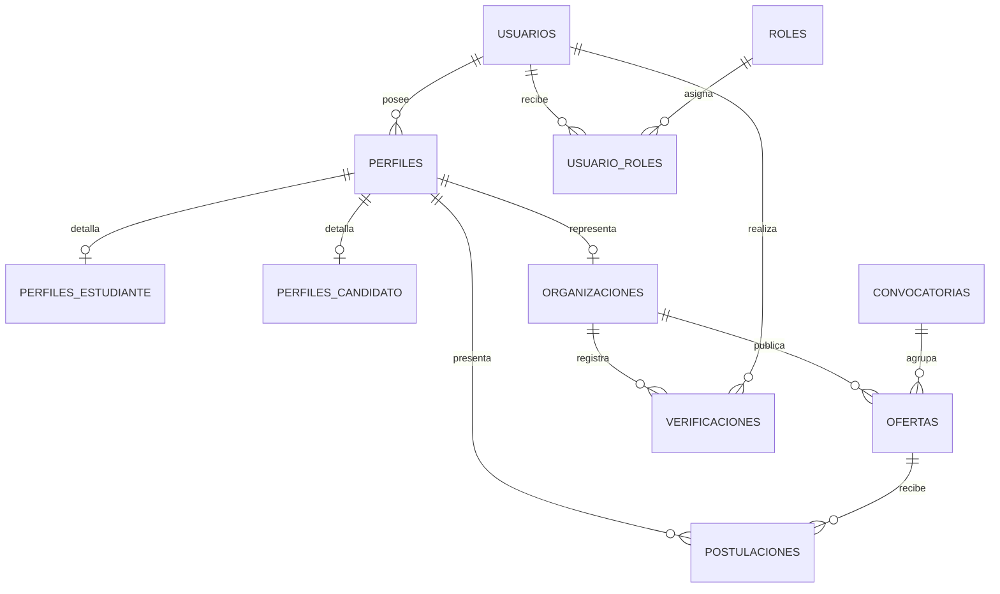

# Esquema inicial de PostgreSQL

## Propósito

Este documento define el modelo relacional inicial para SIPU. Está diseñado para cubrir el MVP de prácticas de la Fase 1 y permitir, sin rediseños incompatibles, los perfiles y ofertas de las fases posteriores.

El archivo ejecutable asociado es [`../backend/database/schema.sql`](../backend/database/schema.sql).

## Decisiones de diseño

- **Usuario y perfil se separan:** una cuenta puede tener varios perfiles a futuro.
- **Roles independientes de perfiles:** los permisos administrativos se gestionan mediante roles, no con condiciones rígidas para cada tipo de usuario.
- **Ofertas clasificadas:** `PRACTICA`, `EMPLEO` y `EMPLEO_PUBLICO` son tipos de oferta, no tipos de usuario. Área, requisitos, duración, horario y correo de contacto quedan asociados a cada oferta.
- **Postulaciones genéricas:** conectan un perfil candidato con cualquier oferta compatible.
- **Extensibilidad:** los detalles académicos, laborales y de organizaciones se almacenan en tablas especializadas.
- **Trazabilidad:** las entidades principales incluyen fechas de creación y actualización.

## Entidades

| Entidad | Responsabilidad |
| --- | --- |
| `usuarios` | Credenciales, datos de contacto y estado de la cuenta. |
| `roles` / `usuario_roles` | Autorización independiente de perfiles. |
| `perfiles` | Identidad funcional de una cuenta: estudiante, candidato externo u organización. |
| `perfiles_estudiante` | Datos académicos del perfil de estudiante. |
| `perfiles_candidato` | Datos laborales del candidato externo. |
| `organizaciones` | Datos y verificación de empresas u organizaciones. |
| `ofertas` | Prácticas, empleos generales y convocatorias de empleo público. |
| `postulaciones` | Relación entre candidato y oferta. |
| `convocatorias` | Agrupación de ofertas públicas para la Fase 4. |
| `verificaciones` | Historial de verificaciones de organizaciones. |

## Relaciones principales



## Tipos controlados

| Tipo | Valores iniciales |
| --- | --- |
| Tipo de perfil | `ESTUDIANTE`, `CANDIDATO_EXTERNO`, `ORGANIZACION` |
| Tipo de oferta | `PRACTICA`, `EMPLEO`, `EMPLEO_PUBLICO` |
| Estado de oferta | `BORRADOR`, `PUBLICADA`, `CERRADA`, `CANCELADA` |
| Estado de postulación | `ENVIADA`, `EN_REVISION`, `PRESELECCIONADA`, `RECHAZADA`, `RETIRADA`, `ACEPTADA` |
| Estado de verificación | `PENDIENTE`, `APROBADA`, `RECHAZADA` |

La verificación de una organización se registra en `verificaciones` (historial) y se refleja en el indicador `organizaciones.verificada`. Aprobar una verificación activa ese indicador; rechazarla lo desactiva.

## Ejecutar el esquema localmente

1. Instale PostgreSQL 15 o superior y cree una base de datos denominada `sipu`.
2. Cree `backend/.env` a partir de `../.env.example` y ajuste `DATABASE_URL`.
3. Ejecute desde la raíz del repositorio:

   ```bash
   psql -U postgres -d sipu -f backend/database/schema.sql
   ```

4. Si actualiza una base existente, no vuelva a ejecutar el esquema inicial; aplique la migración aditiva de detalles de oferta:

   ```bash
   psql -U postgres -d sipu -f backend/database/migrations/20261008_offer_details.sql
   ```

   Y la migración de verificación de organizaciones:

   ```bash
   psql -U postgres -d sipu -f backend/database/migrations/20261008_organization_verification.sql
   ```

5. Verifique la instalación en `psql`:

   ```sql
   \dt
   ```

La API usa PostgreSQL para autenticación, perfiles, ofertas y postulaciones. Las migraciones existentes actualizan bases creadas con una versión anterior sin volver a ejecutar el esquema inicial ni borrar información.

## Migraciones automáticas (Fase 5)

Al arrancar, la API ejecuta `schema.sql` si la base está vacía y luego aplica, en orden alfabético, los archivos de `backend/database/migrations/` que no figuren en la tabla `schema_migrations`:

| Columna | Tipo | Descripción |
| --- | --- | --- |
| `nombre` | `TEXT` (PK) | Nombre del archivo de migración. |
| `applied_at` | `TIMESTAMPTZ` | Momento en que se aplicó. |

Toda migración nueva debe ser idempotente (`IF NOT EXISTS`, `UPDATE` con condición) y nombrarse `AAAAMMDD_descripcion.sql`.

| Migración | Propósito |
| --- | --- |
| `20261008_offer_details.sql` | Área, requisitos, duración, horario y correo de contacto en ofertas. |
| `20261008_organization_verification.sql` | Tabla `verificaciones` y columna `organizaciones.verificada`. |
| `20261009_normalize_offer_modality.sql` | Normaliza la modalidad a `Presencial`, `Remota` o `Híbrida` y repara ciudades con codificación dañada. |
| `20261010_offer_type_formacion.sql` | Añade `FORMACION` al tipo de oferta (sin transacción explícita). |
| `20261010_profile_details_files_resets.sql` | Tablas `perfil_educacion`, `perfil_experiencia`, `perfil_habilidades`, `archivos` y `password_resets`, y la columna `usuarios.token_version`. |

## Tablas de la Fase 6

| Tabla | Responsabilidad |
| --- | --- |
| `perfil_educacion` | Formación del candidato, ordenada por `orden`. |
| `perfil_experiencia` | Experiencia laboral del candidato. |
| `perfil_habilidades` | Habilidades por categoría; única por perfil, categoría y nombre sin distinguir mayúsculas. |
| `archivos` | CV (PDF) o foto (PNG/JPG/WEBP) en `BYTEA`; uno por tipo y perfil. |
| `password_resets` | Hash SHA-256 del token de recuperación, vencimiento y uso. |

`usuarios.token_version` se incluye en cada JWT; al cambiar o restablecer la contraseña se incrementa y las sesiones anteriores dejan de ser válidas.

La modalidad de una oferta se valida en la API contra esos tres valores; las variantes (`remoto`, `hibrido`) se convierten al valor canónico.
